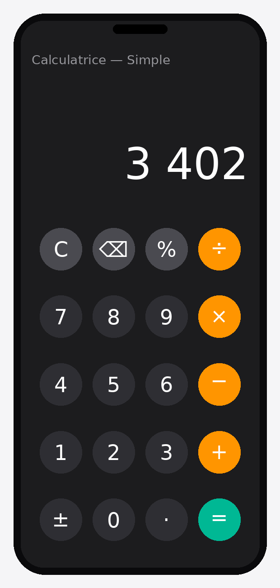
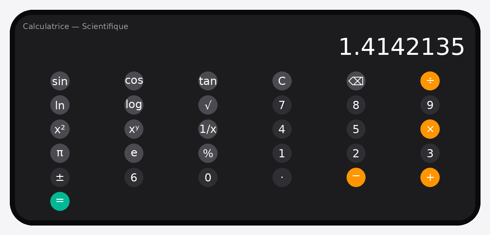

# Calculatrice — Kotlin Multiplateforme + Jetpack Compose

Application Android de calculatrice démontrant :

1. **La gestion des événements `onClick`** sur les boutons numériques et opérateurs.
2. **Deux interfaces selon l'orientation de l'écran** :
   - `PortraitActivity` → **calculatrice simple**
   - `LandscapeActivity` → **calculatrice scientifique**
   - avec gestion des changements de configuration (`orientation|screenSize`).

---

## Aperçu des interfaces

### Mode Portrait — Calculatrice simple (`PortraitActivity`)

### Mode Paysage — Calculatrice scientifique (`LandscapeActivity`)

> 💡 En faisant simplement pivoter le téléphone, l'application bascule
> automatiquement d'une interface à l'autre.

---
